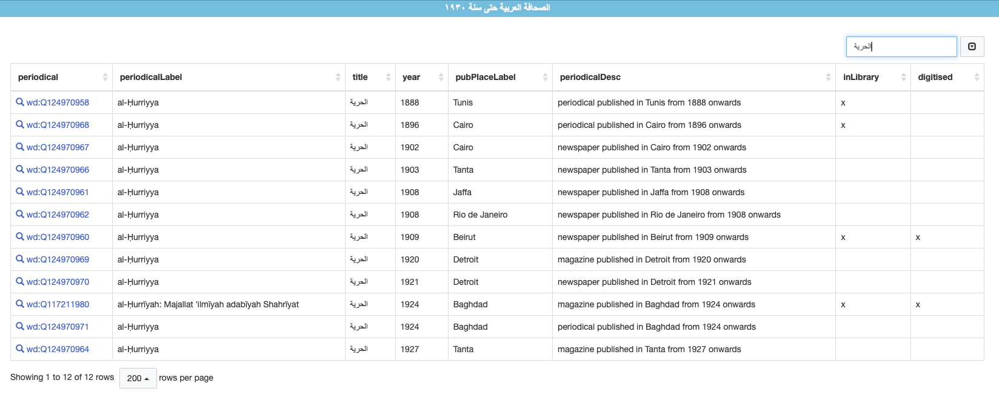

This repository contains a set of SPARQL queries for querying Wikidata for periodicals. Formal documentation is sorely missing, but the workflow and tool chain has been described in some detail in <https://doi.org/10.5281/zenodo.14112647>.

# This repo
## structure

<!-- Wo liegt was in diesem Repo -->

```plain
.
├── queries/          # folder with SPARQL queries
├── subqueries/       # folder for routines and sub queries
├── CITATION.md       # how to cite
├── CONTRIBUTING.md
└── README.md         # this file
```

## file naming conventions

- file names begin with the item type
- file names use key-value pairs. keys are separated by dashes and values by underscores: `-key_value-key_value`.
  - take for example the language of periodicals, which uses the `lang` key and ISO or BCP47 language codes, i.e. `lang_ar` for Arabic.
- The type of display resulting from a SPARQL query is suffixed to the file name using the `disp` key:
  - nothing or `disp_table`: the default table view
  - `disp_bubble`: `#defaultView:BubbleChart`
  - `disp_map`: `#defaultView:Map{"hide":["?coords"]}`
  - `disp_graph`: `#defaultView:Graph`
- reusable subqueries are marked with the prefix `subquery_`

# Queries

Queries are largely modularised, which allows for some plug-and-play approach in chaining modules together.

Most queries are far too long for Wikimedia's link shortener for sharing. I have therefore submitted many to the [query chest service](https://query-chest.toolforge.org/). A list of queries is provided below.

## sample query

The following query provides a list of all Arabic periodicals published before 1930:

<iframe style="width: 100%;height: 70vh;border: none;" src="https://query.wikidata.org/embed.html#%23title%3A%20%D8%A7%D9%84%D8%B5%D8%AD%D8%A7%D9%81%D8%A9%20%D8%A7%D9%84%D8%B9%D8%B1%D8%A8%D9%8A%D8%A9%20%D8%AD%D8%AA%D9%89%20%D8%B3%D9%86%D8%A9%20%D9%A1%D9%A9%D9%A3%D9%A0%0A%23defaultView%3ATable%0APREFIX%20medium%3A%20%3Chttp%3A%2F%2Fwww.wikidata.org%2Fentity%2FQ1002697%3E%20%20%20%20%23%20set%20a%20publication%20type%3A%20periodicals%20(wd%3AQ1002697)%2C%20newspapers%20(wd%3AQ11032)%0ASELECT%20DISTINCT%0A%20%20%3Fperiodical%20%3FperiodicalLabel%20%0A%20%20%3Ftitle%20(YEAR(%3FdateOnset)%20as%20%3Fyear)%20%3FpubPlaceLabel%20%0A%20%20%3FperiodicalDesc%0AWITH%20%7B%0A%20%20SELECT%20DISTINCT%0A%20%20%20%20%3Fperiodical%20%3FdateOnset%0A%20%20WHERE%20%7B%0A%20%20%20%20hint%3ASubQuery%20hint%3ArunOnce%20true%20.%20%20%20%20%23%20this%20might%20save%20some%20time%0A%20%20%20%20VALUES%20%3FdateOfInterest%20%7B%221930-01-01%22%5E%5Exsd%3AdateTime%20%7D.%20%23%20set%20a%20date%20of%20interest%0A%20%20%20%20%3Fperiodical%20wdt%3AP31%2Fwdt%3AP279*%20medium%3A%20%3B%20%20%20%20%20%20%20%20%20%20%20%20%20%20%23%20limit%20to%20medium%0A%20%20%20%20%20%20%20%20%20%20%20%20%20%20(wdt%3AP571%20%7C%20wdt%3AP580)%20%3FdateOnset.%0A%20%20%20%20%3Fperiodical%20wdt%3AP407%2Fwdt%3AP279*%20wd%3AQ13955.%20%20%20%20%20%20%20%20%20%20%20%20%23%20limit%20by%20publication%20language%20(Arabic%20%3D%20Q13955)%0A%20%20%20%20FILTER(%3FdateOnset%20%3C%20%3FdateOfInterest).%20%20%20%20%20%20%20%20%20%20%20%20%20%20%20%20%23%20published%20before%20a%20specific%20date%0A%20%20%7D%0A%20%20ORDER%20BY%20%3FdateOnset%0A%20%20LIMIT%204000%0A%7D%20as%20%25periodicals%0AWHERE%20%7B%0A%20%20INCLUDE%20%25periodicals%0A%20%20%20%20%20%23%20retrieve%20more%20properties%3A%20locations%0A%20%20OPTIONAL%7B%3Fperiodical%20(wdt%3AP291%7Cwdt%3AP159%7Cwdt%3AP276%7Cwdt%3AP495%7Cwdt%3AP131%20)%20%3FpubPlace.%7D%0A%20%20%3Fperiodical%20wdt%3AP1476%20%3Ftitle.%20%23%20retrieve%20titles%0A%20%20FILTER(LANG(%3Ftitle)%20%3D%20'ar').%20%23%20limit%20titles%20to%20Arabic%20strings%0A%20%20%23%20get%20labels%20and%20descriptions%0A%20%20SERVICE%20wikibase%3Alabel%20%7B%0A%20%20%20%20%20%20bd%3AserviceParam%20wikibase%3Alanguage%20%22%5BAUTO_LANGUAGE%5D%2Cmul%2Car%2Cen%2Cfr%2Cde%22.%0A%20%20%20%20%20%20%3Fperiodical%20rdfs%3Alabel%20%3FperiodicalLabel%3B%0A%20%20%20%20%20%20%20%20%20%20schema%3Adescription%20%3FperiodicalDesc.%0A%20%20%20%20%20%20%3FpubPlace%20rdfs%3Alabel%20%3FpubPlaceLabel%0A%20%20%20%20%7D%0A%7D%0AORDER%20BY%20%3FdateOnset%0ALIMIT%205000%0A%23short%20URL%20to%20query%20results%3A%20https%3A%2F%2Fw.wiki%2F9rDP" referrerpolicy="origin" sandbox="allow-scripts allow-same-origin allow-popups"></iframe>

## General workflow

1. Select the basic data set

```sparql
PREFIX medium: <http://www.wikidata.org/entity/Q1002697>    # set a publication type: periodicals (wd:Q1002697), newspapers (wd:Q11032)
SELECT DISTINCT 
    *
# all periodicals before the date of interest
WITH {
  SELECT DISTINCT
    ?periodical ?dateOnset
  WHERE {
    VALUES ?dateOfInterest {"1910-06-01"^^xsd:dateTime }. # set a date of interest
    ?periodical wdt:P31/wdt:P279* medium: ;              # limit to medium
              (wdt:P571 | wdt:P580) ?dateOnset.
    ?periodical wdt:P407/wdt:P279* wd:Q13955.            # limit by publication language (Arabic = Q13955)
    FILTER(?dateOnset < ?dateOfInterest).                # published before a specific date
  }
  ORDER BY ?dateOnset
  LIMIT 4000
} as %periodicals
```

2. Retrieve additional information

### FILTERS
#### Dates

- with data type:
    - `FILTER(?dateOnset < "1930-01-01"^^xsd:dateTime)`
- without data type but additional functions
    - `FILTER( YEAR(?dateOnset) < 1930)`
    - `FILTER( YEAR(COALESCE(?dateInception, ?dateStart)) < 1930).`

### Maps

1. Get locations: `?periodical (wdt:P291|wdt:P159|wdt:P276|wdt:P495|wdt:P131 ) ?pubPlace.`
2. Get coordinates `?pubPlace wdt:P625 ?coords`
3. Get geoshape `?pubPlace wdt:P3896 ?geoshape`
4. Options: #defaultView:Map{"hide":["?coords"], "markercluster": "true"}

## Queries on query chest

[rq:publications-transliterated-title]: https://query-chest.toolforge.org/redirect/dSZmMD4FSCeucOakcKCuKkYSg6wo8GCeyO8YqugMe2z 

[rq:periodicals-holdings-2024-03-18]: https://query-chest.toolforge.org/redirect/eKwMLGU9oGqiEqCI2OUqKw2uy60KoKscqQgsWmwcaU6 

[rq:arabic-periodicals-images]: https://query-chest.toolforge.org/redirect/nNIwitQHCq02U4Ww8MwIGS4EcY4y6qCO2uOWqGwWoGU 

### basic tables

- [][rq:periodicals-lang_ar-basic]
- [Arabic periodicals, ranked by number of collections][rq:count-collections]
- [Arabic periodicals, ranked by number of digitised collections][rq:count-digitised]

[rq:periodicals-lang_ar-basic]: https://query-chest.toolforge.org/redirect/5NZuEN6OBMmiWm0IoYYU6caa2q6AKeqUKEKe0uqy4Ml

[rq:count-collections]: https://query-chest.toolforge.org/redirect/wnhAUtiqI4MQyW0MOsqAyOqOwSuE6iSUcU28oCUAqkY 

[rq:count-digitised]: https://query-chest.toolforge.org/redirect/JwwYdMXGLosUGeSKCucwckW0gMmEqAY2Uosa2MiMYev

### counts

Simple counts for documtary purposes

- [All periodicals on Wikidata (items created before 18 March 2024)][rq:count-periodicals-all-2024-03-18]
- [Arabic periodicals on Wikidata (items created before 18 March 2024)][rq:count-arabic-periodicals-2024-03-18]
- [Arabic periodicals on Wikidata (items created before 8 August 2024)][rq:count-arabic-periodicals-2024-08-08]


[rq:count-arabic-periodicals-2024-03-18]: https://query-chest.toolforge.org/redirect/oYNezk1fgs8UQyCQoKsSemEiWu6oiWSAq0As6k2QISv 

[rq:count-periodicals-all-2024-03-18]: https://query-chest.toolforge.org/redirect/BGlKl7mq24UyuaKyESSwQMYUS4S2qgwgUg4OuuOYksf 

[rq:count-arabic-periodicals-2024-08-08]: https://query-chest.toolforge.org/redirect/eO3ox4S9FwUeY24gs24CU6OOqiI0WiYKiEKmggM46sn 


### Bubble charts

[rq:bubble-lang-2024-03-18]: https://query-chest.toolforge.org/redirect/dMk3vPTaZkuiqe804Wqeqkmi8SooO260qSCmAG08MI7 

[rq:bubble-lang-2024-08-08]: https://query-chest.toolforge.org/redirect/26dFDncq2WMkmei8eg26qwISOKyMAmioq6Co8WwUIKQ 

#### Historical stages of the data set

![Bubble chart of publication languages (items created before 18 March 2024), [SPARQL query][rq:bubble-lang-2024-03-18]. Note the surprising prominence of Swedish.](assets/img/wikidata-bubble_periodicals-languages-2024-03-18.png)


### Maps

Maps with cluster markers for publication locations of periodicals published before 1930

[rq:map-periodicals-ota-cluster]: https://query-chest.toolforge.org/redirect/wLTnRa9d2GceWkacK6Ek8uSUaWIGaamSsqe8C6kaMCI 

#### Historical stages of the data set

![Map of all periodicals (items created before 18 March 2024), [SPARQL query][rq:map-periodicals-all-2024-03-18-cluster].](assets/img/wikidata-map_periodicals-all-2024-03-18_markercluster.png)

![Map of all Arabic periodicals (items created before 18 March 2024), [SPARQL query][rq:map-periodicals-ar-2024-03-18-cluster].](assets/img/wikidata-map_periodicals-arabic-2024-03-18_markercluster.png)

![Map of all Arabic periodicals (items created until 8 August 2024), [SPARQL query][rq:map-periodicals-ar-2024-08-08-cluster].](assets/img/wikidata-map_periodicals-arabic-2024-08-08_markercluster.png)

[rq:map-periodicals-all-2024-03-18-cluster]: https://query-chest.toolforge.org/redirect/8K4bVhyOmm6seAwkmiIqsGEEY4yCooU6YMGsKSYQ2Eb 

[rq:map-periodicals-all-2024-08-08-cluster]: https://query-chest.toolforge.org/redirect/mYSKHVP1qQamkCeYQmSsKMWMGwg266UqEayEcYwgUy7 

[rq:map-periodicals-ar-2024-03-18-cluster]: https://query-chest.toolforge.org/redirect/LAwIgT9wqucyaW0mCQ0Ms2uKGUmygM6mwcSIuKKKyc0 

[rq:map-periodicals-ar-2024-08-08-cluster]: https://query-chest.toolforge.org/redirect/obqUZJy6sY448EAesSQSaW80kAsYucuIiE8sO8kY2Gd 

[rq:map-periodicals-ota-2024-08-01-cluster]: https://query-chest.toolforge.org/redirect/7c5YPWykbICAWcWaAYqYwMqEo6qUaaou0WaIugIqGYu


#### Collections

https://query-chest.toolforge.org/redirect/qmTkCttCikGMoCI8kSkS4Uq8MuyS8EyMKS6KaOQQqsf

#### Levant

![Map of newspapers published in the Eastern Mediterranean during the summer of 1910, [SPARQL query][rq:map-levant-1910-06].](assets/img/wikidata-map_periodicals-bilad-al-sham-1910-06-15.png)

![Map of newspapers published in the Eastern Mediterranean during the summer of 1910 with known holdings, [SPARQL query][rq:map-levant-1910-06-holdings].](assets/img/wikidata-map_periodicals-bilad-al-sham-1910-06-15_holdings.png)

![Map of newspapers published in the Eastern Mediterranean during the summer of 1910 with digitised copies, [SPARQL query][rq:map-levant-1910-06-digitised].](assets/img/wikidata-map_periodicals-bilad-al-sham-1910-06-15_digitised.png)

[rq:map-levant-1910-06]: https://query-chest.toolforge.org/redirect/v8e8UlL8s2gM46Ieou4UeMOimUSsyUS40uso0OAaIUL 

[rq:map-levant-1910-06-holdings]: https://query-chest.toolforge.org/redirect/W5asaV1sTwmMoAogKO8ckaoOgyIGU2Aq8QSQKWYkcSS 

[rq:map-levant-1910-06-digitised]: https://query-chest.toolforge.org/redirect/ZtdJnjhGtM4SGUks2GEYwcAmwKGeCmS8icSua0ISkwW 

#### Palestine

[rq:palestine-1948_periodicals_map]: https://query-chest.toolforge.org/redirect/WSB7DBbD7oYkIU2k8KoksQkaauOu8ew8cEOs4CCyCID

[rq:palestine-1948_periodicals-holdings_map]: https://query-chest.toolforge.org/redirect/FastY9YqoKky0AAggWsk4mMeQW284SIOkIGGiEEMQKd

[rq:palestine-1948_periodicals-holdings_map-collection]: https://query-chest.toolforge.org/redirect/Bsfc1wk38K2WEaQk84qGkyeOkggEea8kGuSMqgGOEU1

[rq:palestine-1948_periodicals-digitised_map]: https://query-chest.toolforge.org/redirect/aDYfGc5U3MCeOaWIg0OcKoYK2MMweuiOo8KGA26yOib


