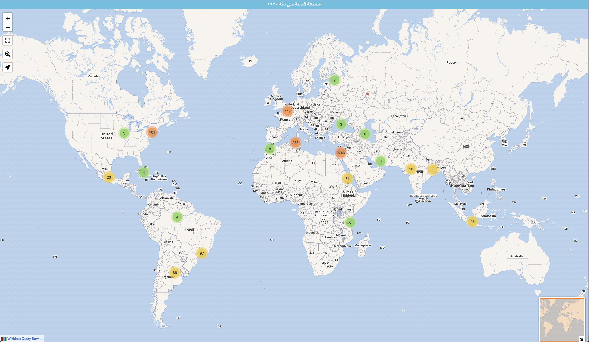
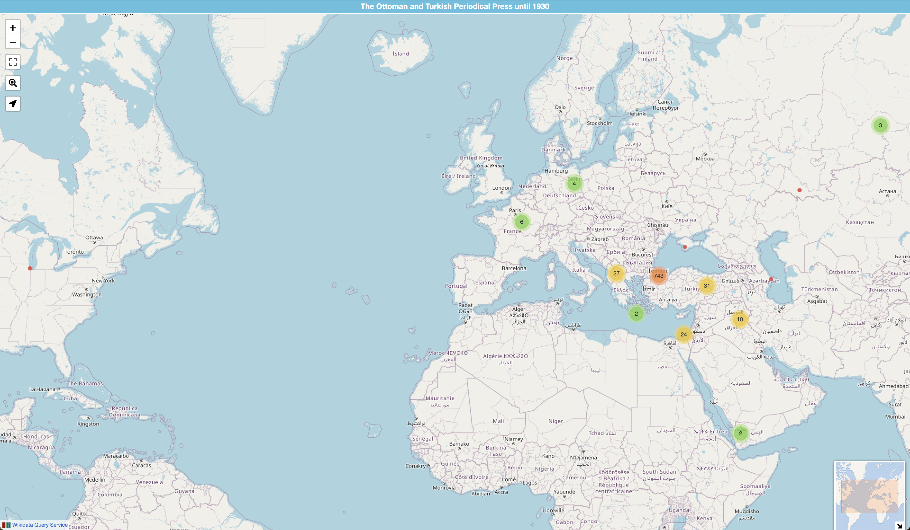
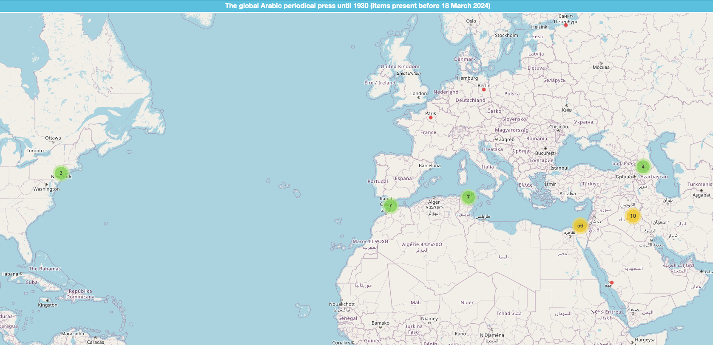
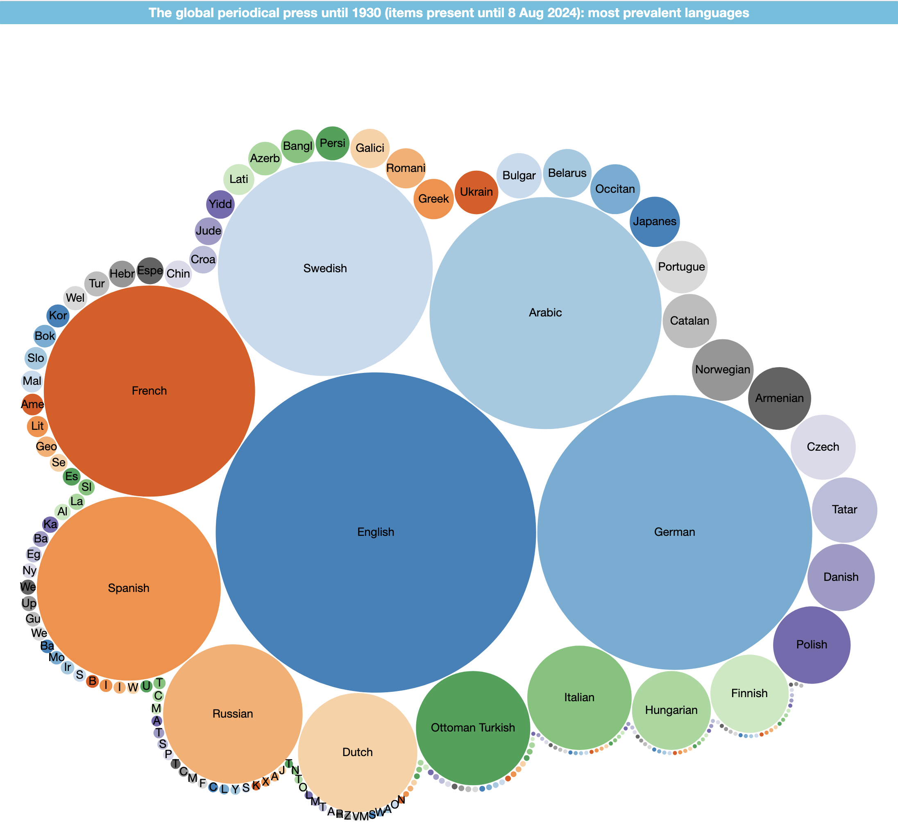
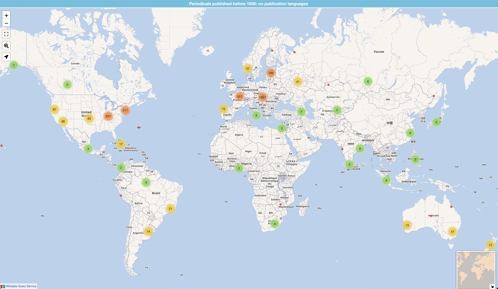
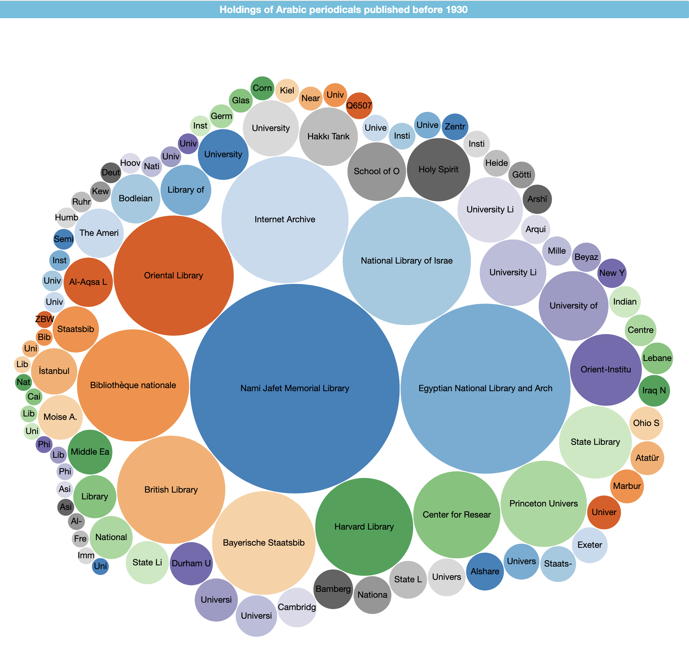
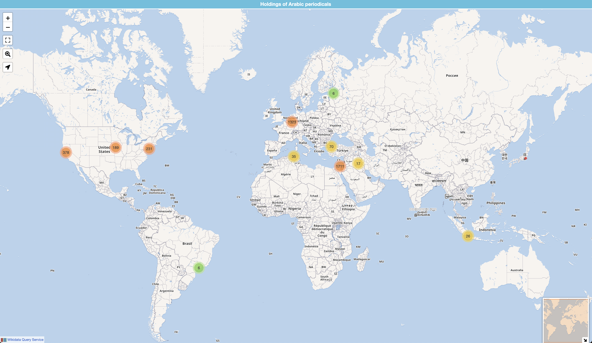
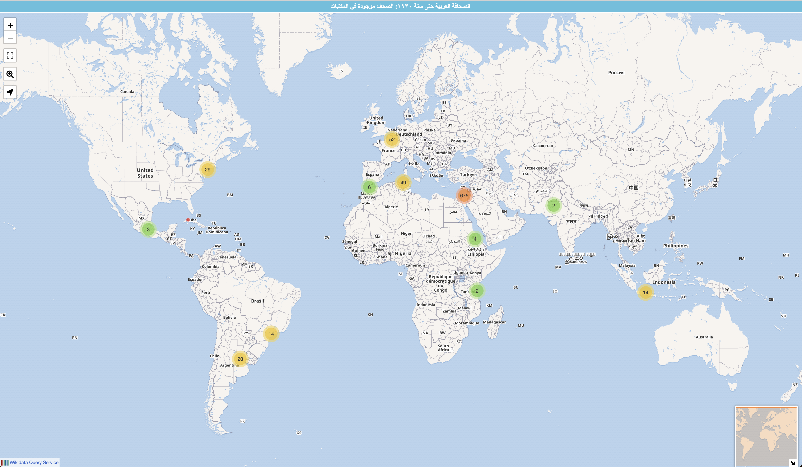
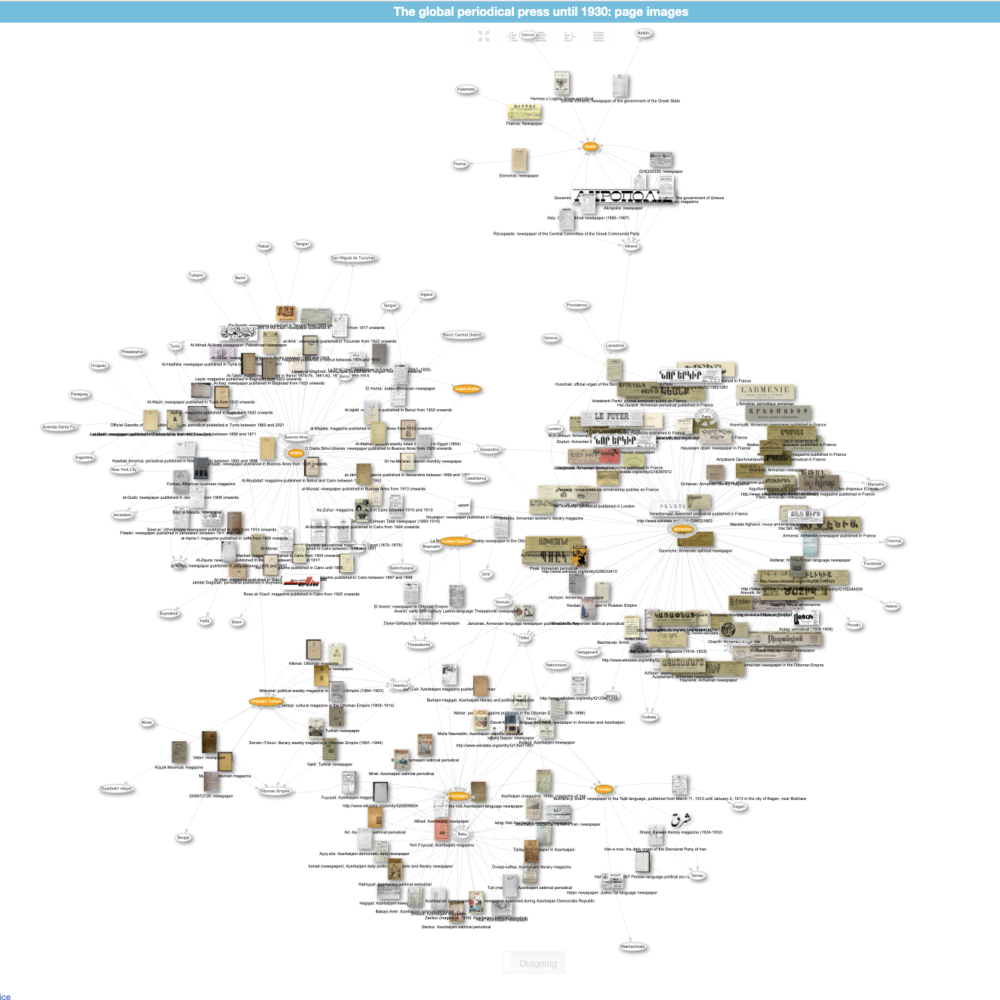

Queries are largely modularised, which allows for some plug-and-play approach in chaining modules together. The language of results will depend on your operating system's language. 
Most queries are far too long for Wikimedia's link shortener for sharing. I have therefore submitted many to the [query chest service](https://query-chest.toolforge.org/).

## basic tables

1. All Arabic periodicals published before 1930, including information on holdings and digitised copies
    - [SPARQL query][rq:periodicals-lang_ar-basic]
    - [][rq:periodicals-lang_ar-basic]
2. [Arabic periodicals, ranked by number of collections][rq:count-collections]. Note that one can easily switch to a bubble graph with the left-hand menu.
3. [Arabic periodicals, ranked by number of digitised collections][rq:count-digitised]

## Maps

Maps with cluster markers for publication locations of periodicals published before 1930

1. Map of all Arabic periodicals
    - [SPARQL query][rq:periodicals-lang_ar-basic-disp_map]
    - [][rq:periodicals-lang_ar-basic-disp_map]
2. Map of all Ottoman periodicals 
    - [SPARQL query][rq:map-periodicals-ota-cluster]
    - [][rq:map-periodicals-ota-cluster]

### Historical stages of the data set

1. Map of all periodicals (items created before 18 March 2024)
    - [SPARQL query][rq:map-periodicals-all-2024-03-18-cluster]
    - [][rq:map-periodicals-all-2024-03-18-cluster]
2. Map of all Arabic periodicals (items created before 18 March 2024)
    - [SPARQL query][rq:map-periodicals-ar-2024-03-18-cluster]
    - [][rq:map-periodicals-ar-2024-03-18-cluster]
3. Map of all Arabic periodicals (items created until 8 August 2024)
    - [SPARQL query][rq:map-periodicals-ar-2024-08-08-cluster]
    - [][rq:map-periodicals-ar-2024-08-08-cluster]

## counts

Simple counts for documtary purposes

- [All periodicals on Wikidata (items created before 18 March 2024)][rq:count-periodicals-all-2024-03-18]
- [Arabic periodicals on Wikidata (items created before 18 March 2024)][rq:count-arabic-periodicals-2024-03-18]
- [Arabic periodicals on Wikidata (items created before 8 August 2024)][rq:count-arabic-periodicals-2024-08-08]

## publication languages

1. Bubble chart of publication languages
    - [SPARQL query][rq:languages-disp_bubble]
    - [][rq:languages-disp_bubble]
2. Map of periodicals in the publication languages of the Eastern Mediterranean, with layers for languages
    - [SPARQL query][rq:periodicals-layers_languages-disp_map]
    - [][rq:periodicals-layers_languages-disp_map]
3. Map of periodicals without a publication language
    - [SPARQL query][rq:periodicals-filter_missing-lang]
    - [][rq:periodicals-filter_missing-lang]

### Historical stages of the data set

1. Bubble chart of publication languages (items created before 18 March 2024). Note the surprising prominence of Swedish.
    - [SPARQL query][rq:bubble-lang-2024-03-18]
    - [][rq:bubble-lang-2024-03-18]
2. Bubble chart of publication languages (items created before 8 August 2024). Note the surprising prominence of Swedish.
    - [SPARQL query][rq:bubble-lang-2024-08-08]
    - [][rq:bubble-lang-2024-08-08]

## holdings / collections

1. Bubble graph of collections of Arabic periodicals. Note the surprising prominence of the Internet Archive!
    - [SPARQL query][rq:holdings_periodicals-lang_ar-disp_bubble]
    - [][rq:holdings_periodicals-lang_ar-disp_bubble]
2. Map of Arabic periodicals with kown holdings. Periodicals are mapped to the location of the holding institution. 
    - [SPARQL query][rq:holdings_periodicals-lang_ar-disp_map]
    - [][rq:holdings_periodicals-lang_ar-disp_map]
3. Map of Arabic periodicals with known holdings.
    - [SPARQL query][rq:periodicals-lang_ar-holdings-disp_map]
    - [][rq:periodicals-lang_ar-holdings-disp_map]
4. List of Arabic periodicals with a single known holding. Of importance if your had the resources for digitisation.
    - [SPARQL query][rq:periodicals-lang_ar-holdings-filter_count-1]
5. Map Arabic periodicals in a specific holding (e.g. AUB's Jafet Library)
    - [SPARQL query][rq:periodicals-lang_ar-filter_collection-disp_map]

## editors

1. Images of editors of Arabic periodicals found on WikiCommons
    - [SPARQL query][rq:editors-disp_imagegrid]
    - [][rq:editors-disp_imagegrid]

## front pages

1. Network of front pages, locations and publication languages
    - [SPARQL query][rq:periodicals-lang_ar-image-disp_graph]
    - [][rq:periodicals-lang_ar-image-disp_graph]

## dimensions

1. Basic table for periodicals with known dimensions
    - [SPARQL query][rq:periodicals-lang_ar-dimensions.rq]

## geographic regions
### Palestine
### Levant

![Map of newspapers published in the Eastern Mediterranean during the summer of 1910, [SPARQL query][rq:map-levant-1910-06].](../assets/img/wikidata-map_periodicals-bilad-al-sham-1910-06-15.png)

![Map of newspapers published in the Eastern Mediterranean during the summer of 1910 with known holdings, [SPARQL query][rq:map-levant-1910-06-holdings].](../assets/img/wikidata-map_periodicals-bilad-al-sham-1910-06-15_holdings.png)

![Map of newspapers published in the Eastern Mediterranean during the summer of 1910 with digitised copies, [SPARQL query][rq:map-levant-1910-06-digitised].](../assets/img/wikidata-map_periodicals-bilad-al-sham-1910-06-15_digitised.png)

## external IDs

These can be used for further queries to external APIs

1. Hathi IDs: [SPARQL query][rq:periodicals-lang_ar-filter_ids-hathi]
    - can be used to query HathiTrust for copies via `https://catalog.hathitrust.org/api/volumes/full/recordnumber/{ID}.json`
2. OCLC IDs: [SPARQL query][rq:periodicals-lang_ar-filter_ids-oclc]
    - can be used to query HathiTrust for copies via `https://catalog.hathitrust.org/api/volumes/full/oclc/{ID}.json`

<!-- external IDs -->

[rq:periodicals-lang_ar-filter_ids-hathi]: https://query-chest.toolforge.org/redirect/rLaytNA78qsiw2uAuusEMCwESG8yEwqIOWE2AOwwoIZ
[rq:periodicals-lang_ar-filter_ids-oclc]: https://query-chest.toolforge.org/redirect/kChWMCQzq2YAy6o0SsAikiouKgIMaqWIos0WwkwuCoa

<!-- links -->

[rq:publications-transliterated-title]: https://query-chest.toolforge.org/redirect/dSZmMD4FSCeucOakcKCuKkYSg6wo8GCeyO8YqugMe2z 

[rq:periodicals-holdings-2024-03-18]: https://query-chest.toolforge.org/redirect/eKwMLGU9oGqiEqCI2OUqKw2uy60KoKscqQgsWmwcaU6 

[rq:arabic-periodicals-images]: https://query-chest.toolforge.org/redirect/nNIwitQHCq02U4Ww8MwIGS4EcY4y6qCO2uOWqGwWoGU 

<!-- basic tables -->

[rq:periodicals-lang_ar-basic]: https://query-chest.toolforge.org/redirect/5NZuEN6OBMmiWm0IoYYU6caa2q6AKeqUKEKe0uqy4Ml

[rq:count-collections]: https://query-chest.toolforge.org/redirect/wnhAUtiqI4MQyW0MOsqAyOqOwSuE6iSUcU28oCUAqkY 

[rq:count-digitised]: https://query-chest.toolforge.org/redirect/JwwYdMXGLosUGeSKCucwckW0gMmEqAY2Uosa2MiMYev

<!-- maps -->

[rq:periodicals-lang_ar-basic-disp_map]: https://query-chest.toolforge.org/redirect/KkTnCUlWc4MI6WKwSm6CeY4GM8EGOyScEsi4Sw0oOq4

[rq:map-periodicals-ota-cluster]: https://query-chest.toolforge.org/redirect/wLTnRa9d2GceWkacK6Ek8uSUaWIGaamSsqe8C6kaMCI 

[rq:map-periodicals-all-2024-03-18-cluster]: https://query-chest.toolforge.org/redirect/8K4bVhyOmm6seAwkmiIqsGEEY4yCooU6YMGsKSYQ2Eb 

[rq:map-periodicals-all-2024-08-08-cluster]: https://query-chest.toolforge.org/redirect/mYSKHVP1qQamkCeYQmSsKMWMGwg266UqEayEcYwgUy7 

[rq:map-periodicals-ar-2024-03-18-cluster]: https://query-chest.toolforge.org/redirect/LAwIgT9wqucyaW0mCQ0Ms2uKGUmygM6mwcSIuKKKyc0 

[rq:map-periodicals-ar-2024-08-08-cluster]: https://query-chest.toolforge.org/redirect/obqUZJy6sY448EAesSQSaW80kAsYucuIiE8sO8kY2Gd 

[rq:map-periodicals-ota-2024-08-01-cluster]: https://query-chest.toolforge.org/redirect/7c5YPWykbICAWcWaAYqYwMqEo6qUaaou0WaIugIqGYu

<!-- counts -->

[rq:count-arabic-periodicals-2024-03-18]: https://query-chest.toolforge.org/redirect/oYNezk1fgs8UQyCQoKsSemEiWu6oiWSAq0As6k2QISv 

[rq:count-periodicals-all-2024-03-18]: https://query-chest.toolforge.org/redirect/BGlKl7mq24UyuaKyESSwQMYUS4S2qgwgUg4OuuOYksf 

[rq:count-arabic-periodicals-2024-08-08]: https://query-chest.toolforge.org/redirect/eO3ox4S9FwUeY24gs24CU6OOqiI0WiYKiEKmggM46sn 

<!-- languages -->

[rq:periodicals-filter_missing-lang]: https://query-chest.toolforge.org/redirect/xXzyJrwD4qGACuAcayGyGEW4AUE8G8Y8wmCMc8cqKwG

[rq:periodicals-layers_languages-disp_map]: https://query-chest.toolforge.org/redirect/uAOfzguDGgAA6Ma2yseCsOOmGOOmaq8Go6sQQ6YEMWh

[rq:languages-disp_bubble]: https://w.wiki/ArRb

[rq:bubble-lang-2024-03-18]: https://query-chest.toolforge.org/redirect/dMk3vPTaZkuiqe804Wqeqkmi8SooO260qSCmAG08MI7 

[rq:bubble-lang-2024-08-08]: https://query-chest.toolforge.org/redirect/26dFDncq2WMkmei8eg26qwISOKyMAmioq6Co8WwUIKQ 

[rq:periodicals-lang_ar-holdings-filter_count-1]: https://query-chest.toolforge.org/redirect/r9Gn5nKhkWUYgyYwOU08qAk64wWOQO4ycuCcsSi6Syc

[rq:periodicals-lang_ar-holdings-disp_map]: https://query-chest.toolforge.org/redirect/w3zZsU79KQEuYUk8kk2MEwGaQg08w0GkYo2wYSksGGY

[rq:holdings_periodicals-lang_ar-disp_map]: https://query-chest.toolforge.org/redirect/WvUD5eWjtQqKOEC02cQKmCQguM2okyIaAW46giAaGuX

[rq:holdings_periodicals-lang_ar-disp_bubble]: https://query-chest.toolforge.org/redirect/5jePPWeZe42UCWwCmYyIc2mmcW242euOIeaEUiS0O0j

<!-- holdings -->

[rq:periodicals-lang_ar-filter_collection-disp_map]: https://query-chest.toolforge.org/redirect/qmTkCttCikGMoCI8kSkS4Uq8MuyS8EyMKS6KaOQQqsf

[rq:periodicals-lang_ar-holdings-filter_count-1]: https://query-chest.toolforge.org/redirect/r9Gn5nKhkWUYgyYwOU08qAk64wWOQO4ycuCcsSi6Syc

[rq:periodicals-lang_ar-holdings-disp_map]: https://query-chest.toolforge.org/redirect/w3zZsU79KQEuYUk8kk2MEwGaQg08w0GkYo2wYSksGGY

[rq:holdings_periodicals-lang_ar-disp_map]: https://query-chest.toolforge.org/redirect/WvUD5eWjtQqKOEC02cQKmCQguM2okyIaAW46giAaGuX

[rq:holdings_periodicals-lang_ar-disp_bubble]: https://query-chest.toolforge.org/redirect/5jePPWeZe42UCWwCmYyIc2mmcW242euOIeaEUiS0O0j

<!-- specific regions -->

[rq:map-levant-1910-06]: https://query-chest.toolforge.org/redirect/v8e8UlL8s2gM46Ieou4UeMOimUSsyUS40uso0OAaIUL 

[rq:map-levant-1910-06-holdings]: https://query-chest.toolforge.org/redirect/W5asaV1sTwmMoAogKO8ckaoOgyIGU2Aq8QSQKWYkcSS 

[rq:map-levant-1910-06-digitised]: https://query-chest.toolforge.org/redirect/ZtdJnjhGtM4SGUks2GEYwcAmwKGeCmS8icSua0ISkwW 

[rq:palestine-1948_periodicals_map]: https://query-chest.toolforge.org/redirect/WSB7DBbD7oYkIU2k8KoksQkaauOu8ew8cEOs4CCyCID

[rq:palestine-1948_periodicals-holdings_map]: https://query-chest.toolforge.org/redirect/FastY9YqoKky0AAggWsk4mMeQW284SIOkIGGiEEMQKd

[rq:palestine-1948_periodicals-holdings_map-collection]: https://query-chest.toolforge.org/redirect/Bsfc1wk38K2WEaQk84qGkyeOkggEea8kGuSMqgGOEU1

[rq:palestine-1948_periodicals-digitised_map]: https://query-chest.toolforge.org/redirect/aDYfGc5U3MCeOaWIg0OcKoYK2MMweuiOo8KGA26yOib

<!-- editors -->

[rq:editors-disp_imagegrid]: https://query-chest.toolforge.org/redirect/vWy7oAd56GAWYscO0wyQkQ2M4UQmG4m4AMk8MiAcSEw

<!-- images -->
[rq:periodicals-lang_ar-image-disp_graph]: https://query-chest.toolforge.org/redirect/q8HKXkolw8uYgywMEgGsywuqWSMymGWyCEIEoiqku4Z

<!-- dimensions -->
[rq:periodicals-lang_ar-dimensions.rq]: https://query-chest.toolforge.org/redirect/1yFIBRrWui6qQQAGAimCOW8gYg08syeWCmIAkG0sSai