<!-- 
pandoc \
--from markdown-inline_code_attributes --to pdf \
--pdf-engine=typst \
--pdf-engine-opt=--root=${PWD} \
--standalone --toc \
--template=/Users/Shared/BachUni/BachBibliothek/GitHub/pandoc/templates/typst/default.typ \
--lua-filter=/Users/Shared/BachCloud/BTSync/FormerDropbox/Pandoc/lua-filters/scholarly-metadata/scholarly-metadata.lua \
--lua-filter=/Users/Shared/BachCloud/BTSync/FormerDropbox/Pandoc/lua-filters/author-info-blocks/author-info-blocks.lua \
--citeproc --csl=/Users/Shared/BachUni/BachBibliothek/GitHub/pandoc/csl/chicago-author-date.csl \
queries_list.md links_embedded.md -o queries_list.pdf
 -->

# General remarks
## Modularity

The SPARQL queries in this repository are largely modularised utilising Blazegraphe extensions. This allows for some plug-and-play approach in chaining modules together but limits the SPARQL engine to Wikidata's endpoints.

## Language of results

The language of results will depend on your operating system's language. To change this behaviour and explicitly set a target language, one has to change `[AUTO_LANGUAGE]` in the following line to some 2-character ISO language tag:

```sparql
bd:serviceParam wikibase:language "[AUTO_LANGUAGE]".
```

## File naming conventions

<!-- add comment on .rq and .txt -->

- file names begin with the item type to be returned, such as `periodicals`, `editors`, `holdings`, `languages` etc.
- file names use key-value pairs. Keys are separated by dashes and values by underscores: `-key_value-key_value`.
  - take for example the language of periodicals, which uses the `lang` key and ISO or BCP47 language codes, i.e. `lang_ar` for Arabic.
- The type of display resulting from a SPARQL query is suffixed to the file name using the `disp` key:
  - nothing or `disp_table`: the default table view
  - `disp_bubble`: `#defaultView:BubbleChart`
  - `disp_map`: `#defaultView:Map{"hide":["?coords"]}`
  - `disp_graph`: `#defaultView:Graph`
- reusable subqueries are marked with the prefix `subquery_`

## Links to queries

Most queries are far too long for Wikimedia's link shortener, which is otherwise a great option for sharing due to the human-readability of the short links. But all non-ASCII characters have to be URL-encoded and the link shortener enforces a limit of 2.000 characters. I had therefore originally submitted almost all queries to the [query chest service](https://query-chest.toolforge.org/). However, as I should have known, shortened links are particularly prone to link rot and Query Chest has seemingly flushed its caches at some point in mid-July 2026. I have therefore reverted to linking full URLs despite them being extremely long and cumbersome.


# Basic queries
## List of Arabic periodicals

A basic table of all Arabic periodicals published before 1930 sorted by date and including binary toggle for whether there are holdings and digitised copies. 

Note that only Arabic titles are returned and that the language of the item label depends on your operating systems language settings. 

- name: `periodicals-lang_ar-basic`
- link: [SPARQL query on Wikidata][rq:periodicals-lang_ar-basic]
- obsolete link: <https://query-chest.toolforge.org/redirect/5NZuEN6OBMmiWm0IoYYU6caa2q6AKeqUKEKe0uqy4Ml>

[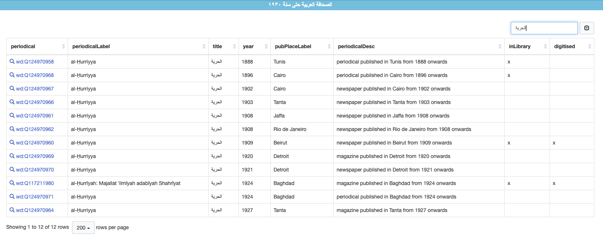][rq:periodicals-lang_ar-basic]

## List of Arabic periodicals by number of holdings

Arabic periodicals, ranked by number of collections. Note that one can easily switch to a bubble graph with the left-hand menu.

- name: `periodicals-lang_ar-holdings-count`
- link: [SPARQL query on Wikidata][rq:periodicals-lang_ar-holdings-count]
- obsolete link: <https://query-chest.toolforge.org/redirect/wnhAUtiqI4MQyW0MOsqAyOqOwSuE6iSUcU28oCUAqkY>

## List of Arabic periodicals by number of digitised collections

Arabic periodicals, ranked by number of digitised collections

- name: `periodicals-lang_ar-digitised-count`
- link: [SPARQL query on Wikidata][rq:periodicals-lang_ar-digitised-count]
- obsolete link: <https://query-chest.toolforge.org/redirect/JwwYdMXGLosUGeSKCucwckW0gMmEqAY2Uosa2MiMYev>

# Maps

The queries in this section all produce maps with cluster markers for publication locations of periodicals published before 1930

## Map of Arabic periodicals

Map of all Arabic periodicals


- name: `periodicals-lang_ar-basic-disp_map`
- link: [SPARQL query on Wikidata][rq:periodicals-lang_ar-basic-disp_map]
- obsolete link: <https://query-chest.toolforge.org/redirect/KkTnCUlWc4MI6WKwSm6CeY4GM8EGOyScEsi4Sw0oOq4>

[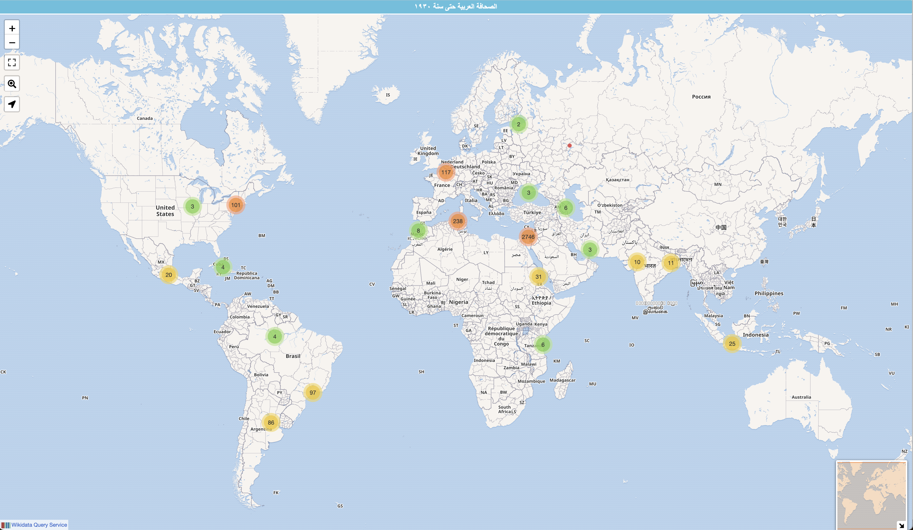][rq:periodicals-lang_ar-basic-disp_map]

## Map of Ottoman periodicals

Map of all Ottoman periodicals. Otherwise similar to the preceding map


- name: `periodicals-lang_ota-basic-disp_map` 
- link: [SPARQL query on Wikidata][rq:periodicals-lang_ota-basic-disp_map] 
- obsolete link: <https://query-chest.toolforge.org/redirect/wLTnRa9d2GceWkacK6Ek8uSUaWIGaamSsqe8C6kaMCI >

[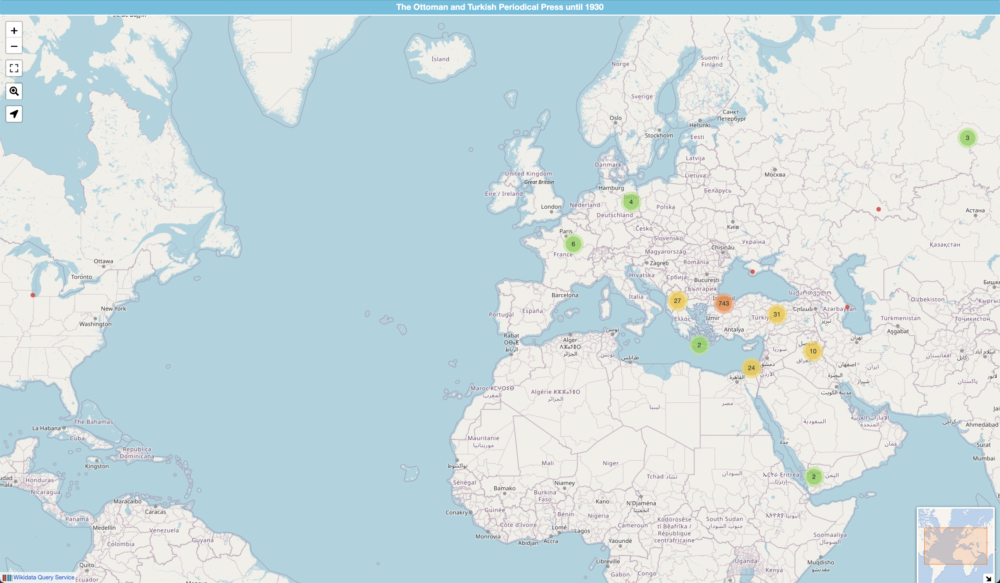][rq:periodicals-lang_ota-basic-disp_map]

## Historical stages of the data set
### Map of all periodicals before our import

Map of all items for periodicals that were created before 18 March 2024


- name: `periodicals-before-2024-03-18-disp_map` 
- link: [SPARQL query on Wikidata][rq:periodicals-before-2024-03-18-disp_map] 
- obsolete link: <https://query-chest.toolforge.org/redirect/8K4bVhyOmm6seAwkmiIqsGEEY4yCooU6YMGsKSYQ2Eb>

[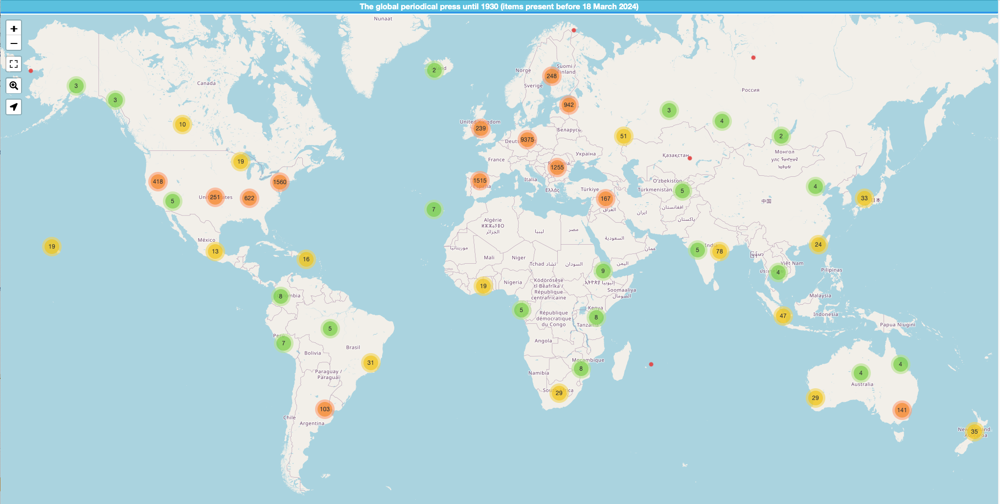][rq:periodicals-before-2024-03-18-disp_map]

### Map of Arabic periodicals before our import

Map of all items for Arabic periodicals that were created before 18 March 2024

- name: `periodicals-lang_ar-before-2024-03-18-disp_map` 
- link: [SPARQL query on Wikidata][rq:periodicals-lang_ar-before-2024-03-18-disp_map] 
- obsolete link: <https://query-chest.toolforge.org/redirect/LAwIgT9wqucyaW0mCQ0Ms2uKGUmygM6mwcSIuKKKyc0>

[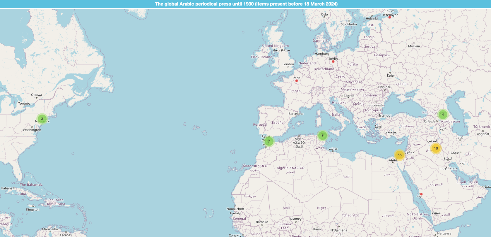][rq:periodicals-lang_ar-before-2024-03-18-disp_map]

### Map of Arabic periodicals before after import

Map of all items for Arabic periodicals that were created until 8 August 2024


- name: `periodicals-lang_ar-before-2024-08-08-disp_map` 
- link: [SPARQL query on Wikidata][rq:periodicals-lang_ar-before-2024-08-08-disp_map] 
- obsolete link: <https://query-chest.toolforge.org/redirect/obqUZJy6sY448EAesSQSaW80kAsYucuIiE8sO8kY2Gd>

[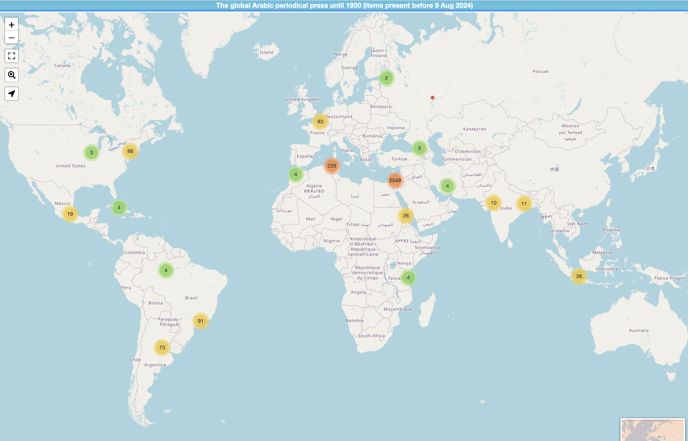][rq:periodicals-lang_ar-before-2024-08-08-disp_map]

# Timelines
## Timeline of Palestinian periodicals 

Timeline of all periodicals published in pre-Nakba Palestine


- name: `palestine-1948_periodicals_timeline` 
- link: [SPARQL query on Wikidata][rq:palestine-1948_periodicals_timeline] 
- obsolete link: <https://query-chest.toolforge.org/redirect/fVec4Zl0eOOWc2k6oMA6aq0CcUqQi2GeIu4oMo4Kioo>

[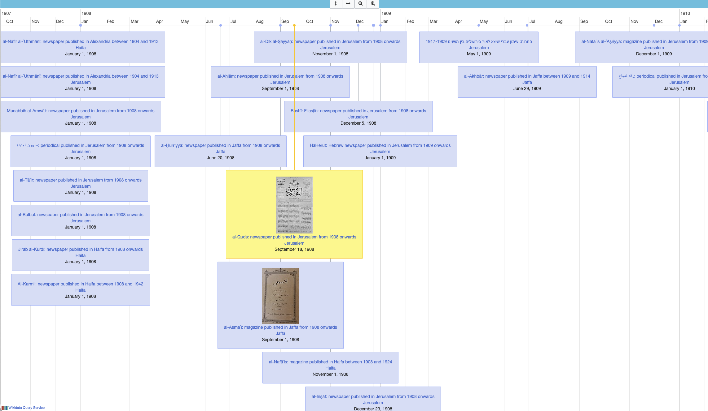][rq:palestine-1948_periodicals_timeline]

# counts

Simple counts for documentary purposes

1. [All periodicals on Wikidata (items created before 18 March 2024)][rq:count-periodicals-all-2024-03-18]
2. [Arabic periodicals on Wikidata (items created before 18 March 2024)][rq:count-arabic-periodicals-2024-03-18]
3. [Arabic periodicals on Wikidata (items created before 8 August 2024)][rq:count-arabic-periodicals-2024-08-08]

## Count of digitised collections per periodical

Count of digitised collections for each Arabic periodical. Returns a table sorted by the number of collections in descending order.

This table illustrates the uncoordinated nature of scanning and digitising efforts. 


- name: `periodicals-lang_ar-digitised-count` 
- link: [SPARQL query on Wikidata][rq:periodicals-lang_ar-digitised-count] 
- obsolete link: <https://query-chest.toolforge.org/redirect/JwwYdMXGLosUGeSKCucwckW0gMmEqAY2Uosa2MiMYev>

[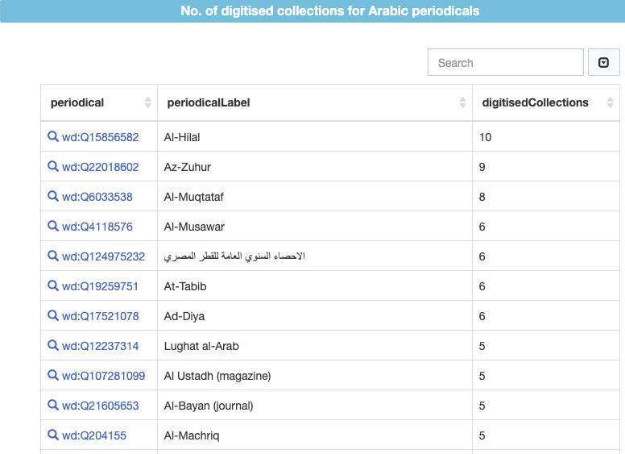][rq:periodicals-lang_ar-digitised-count]


# Publication languages
## Bubble chart of publication languages

Bubble chart of publication languages for all periodicals published before 1930. The size of bubbles correspondes to the number of periodicals published in that language.


- name: `languages-disp_bubble` 
- link: [SPARQL query on Wikidata][rq:languages-disp_bubble] 

[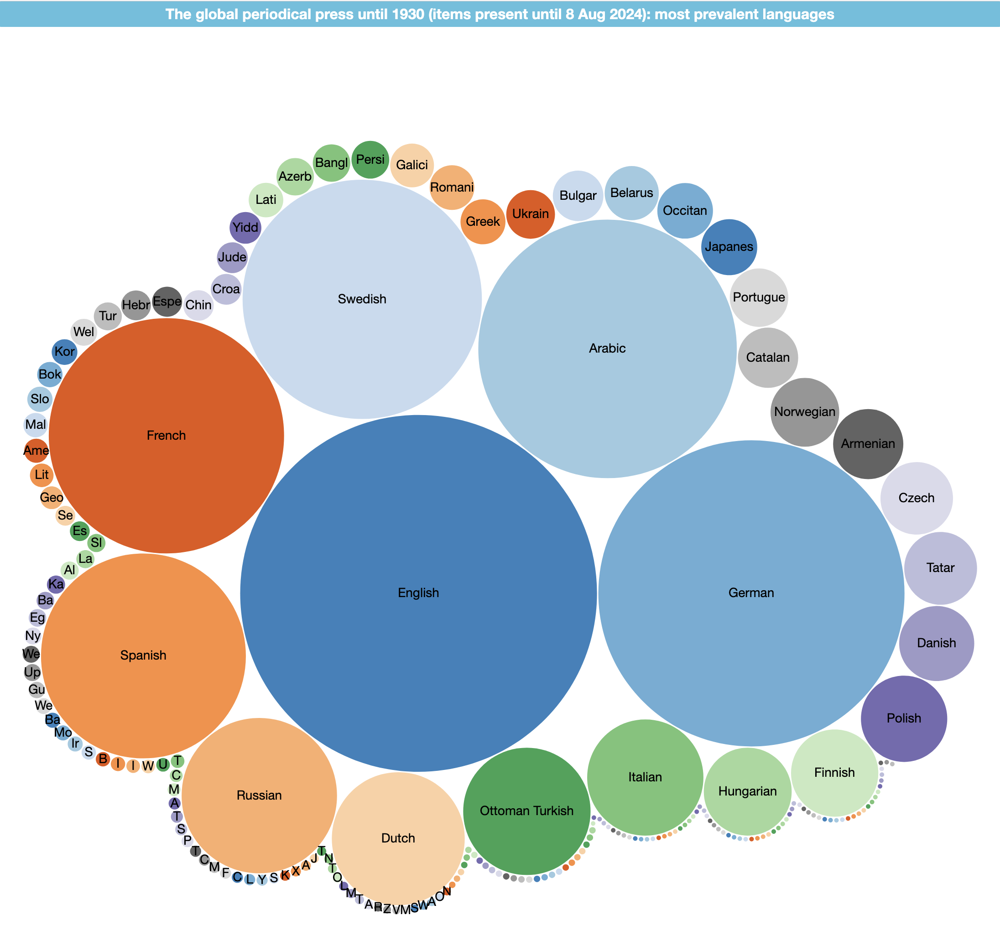][rq:languages-disp_bubble]

## Map of publication languages

Map of periodicals published in the languages of the Eastern Mediterranean and before 1930. Each language is displayed by dots in a different colour.


- name: `periodicals-layers_languages-disp_map` 
- link: [SPARQL query on Wikidata][rq:periodicals-layers_languages-disp_map] 
- obsolete link: <https://query-chest.toolforge.org/redirect/uAOfzguDGgAA6Ma2yseCsOOmGOOmaq8Go6sQQ6YEMWh>

[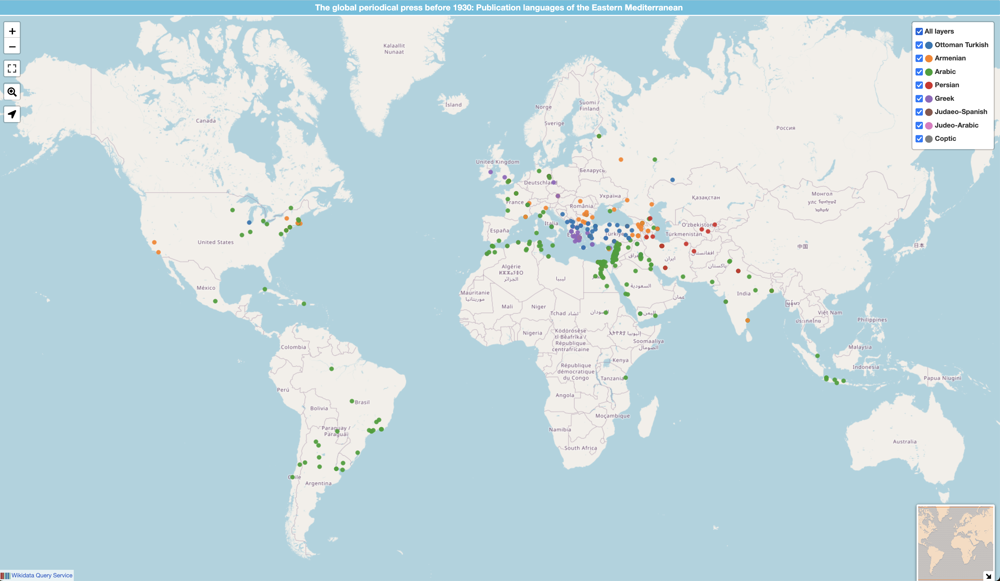][rq:periodicals-layers_languages-disp_map]

## Periodicals without publication languages

Map of periodicals published before 1930 without a recorded publication language. This view helps to determine whether a periodical might be of interest to us.


- name: `periodicals-filter_missing-lang` 
- link: [SPARQL query on Wikidata][rq:periodicals-filter_missing-lang] 
- obsolete link: <https://query-chest.toolforge.org/redirect/xXzyJrwD4qGACuAcayGyGEW4AUE8G8Y8wmCMc8cqKwG>

[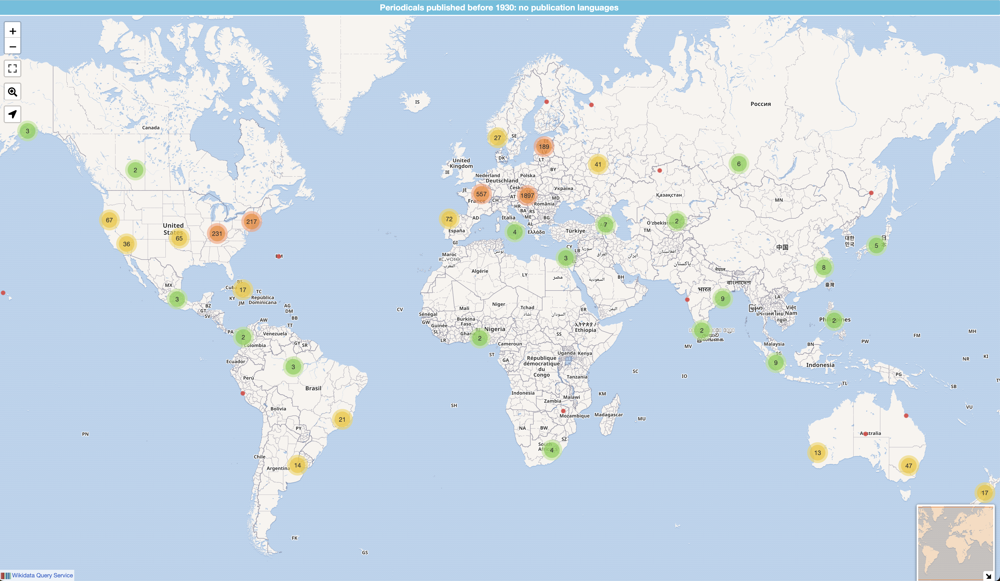][rq:periodicals-filter_missing-lang]

## Historical stages of the data set
### Publication languages on Wikidata before our import

Bubble chart of publication languages (items created before 18 March 2024). Note the surprising prominence of Swedish.


- name: `languages_before-2024-03-18-disp_bubble` 
- link: [SPARQL query on Wikidata][rq:languages_before-2024-03-18-disp_bubble] 
- obsolete link: <https://query-chest.toolforge.org/redirect/dMk3vPTaZkuiqe804Wqeqkmi8SooO260qSCmAG08MI7 >

[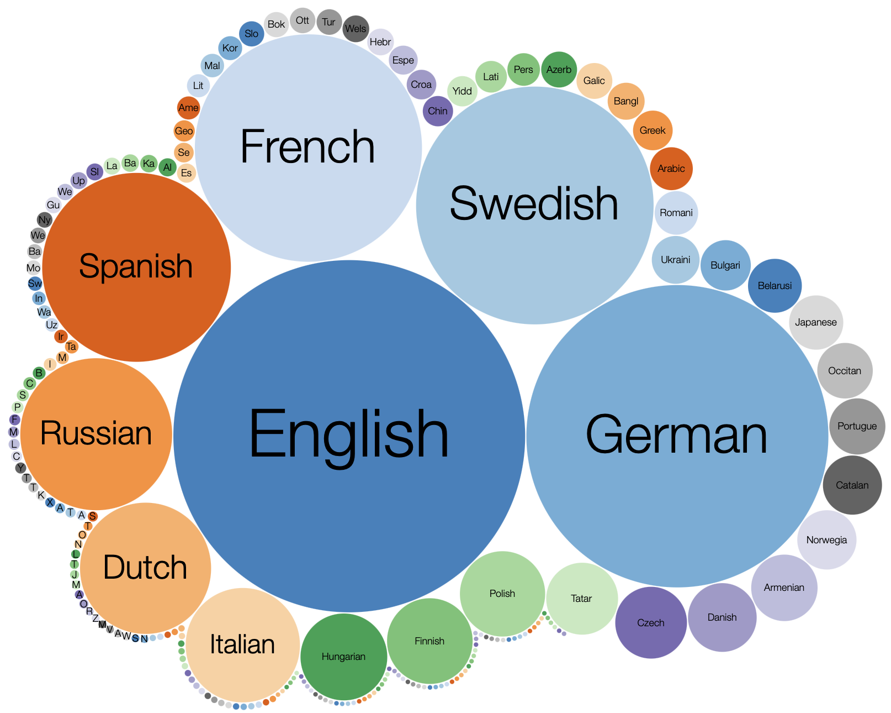][rq:languages_before-2024-03-18-disp_bubble]

### Publication languages on Wikidata after our import

Bubble chart of publication languages (items created before 8 August 2024). Note the surprising prominence of Swedish.


- name: `languages_before-2024-08-08-disp_bubble` 
- link: [SPARQL query on Wikidata][rq:languages_before-2024-08-08-disp_bubble] 
- obsolete link: <https://query-chest.toolforge.org/redirect/26dFDncq2WMkmei8eg26qwISOKyMAmioq6Co8WwUIKQ >

[][rq:languages_before-2024-08-08-disp_bubble]


# Holdings and digitised collections

Queries that focus on the holdings and digitised collections of Arabic periodicals

## Bubble graph of holdings

Bubble graph of collections of Arabic periodicals. The size of bubbles correspondes to the number of periodicals in a specific collection. 
Note the surprising prominence of the Internet Archive!


- name: `holdings_periodicals-lang_ar-disp_bubble` 
- link: [SPARQL query on Wikidata][rq:holdings_periodicals-lang_ar-disp_bubble] 
- obsolete link: <https://query-chest.toolforge.org/redirect/5jePPWeZe42UCWwCmYyIc2mmcW242euOIeaEUiS0O0j>

[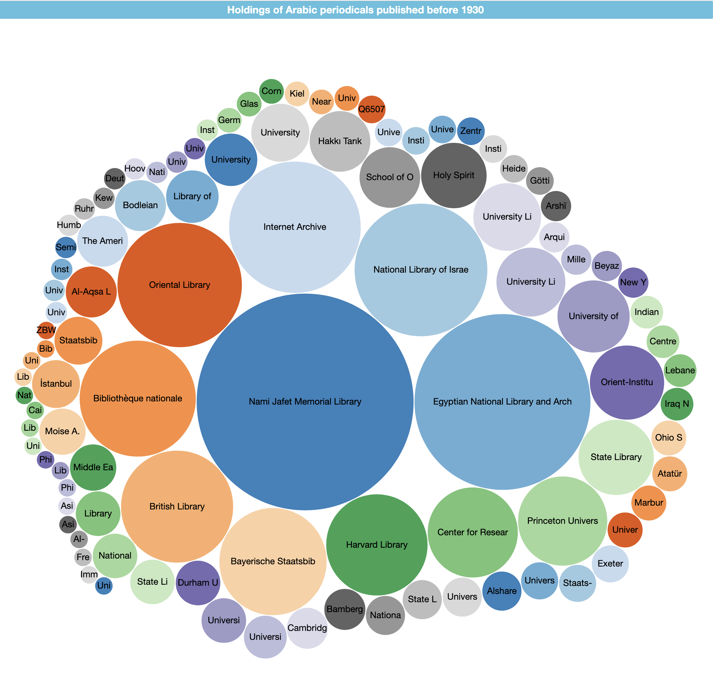][rq:holdings_periodicals-lang_ar-disp_bubble]

## Map of holdings

Map of Arabic periodicals with kown holdings. Periodicals are mapped to the location of the holding institution. 


- name: `holdings_periodicals-lang_ar-disp_map` 
- link: [SPARQL query on Wikidata][rq:holdings_periodicals-lang_ar-disp_map] 
- obsolete link: <https://query-chest.toolforge.org/redirect/WvUD5eWjtQqKOEC02cQKmCQguM2okyIaAW46giAaGuX>

[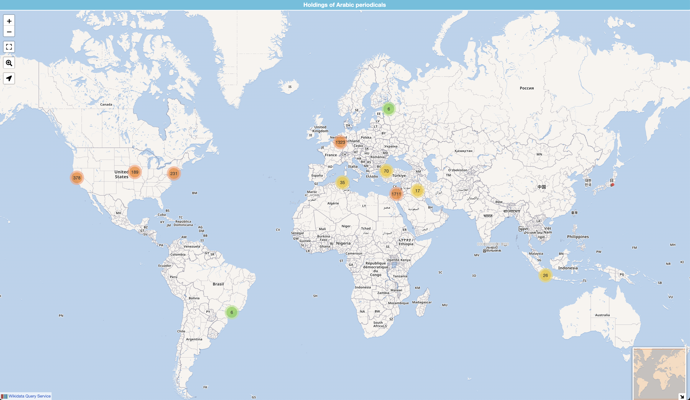][rq:holdings_periodicals-lang_ar-disp_map]

## Map of periodicals with known holdings

Map of Arabic periodicals with known holdings. Periodicals are mapped to the publication place.


- name: `periodicals-lang_ar-holdings-disp_map` 
- link: [SPARQL query on Wikidata][rq:periodicals-lang_ar-holdings-disp_map] 
- obsolete link: <https://query-chest.toolforge.org/redirect/w3zZsU79KQEuYUk8kk2MEwGaQg08w0GkYo2wYSksGGY>

[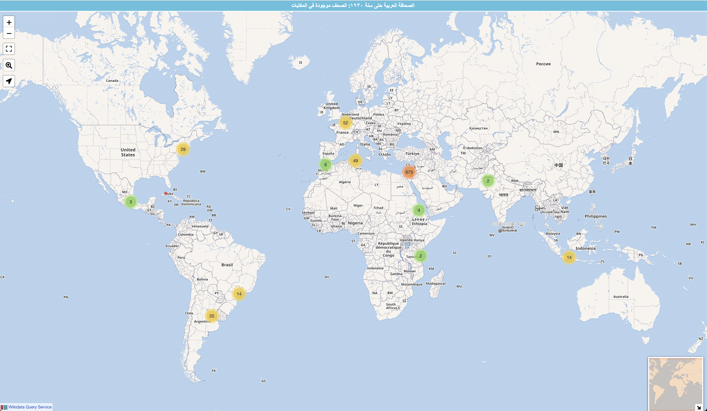][rq:periodicals-lang_ar-holdings-disp_map]

## Periodicals with only a single known holding

List of Arabic periodicals with a single known holding. This list is of utmost importance if you had some resources for digitisation and wanted to spend them as effectively as possible on unique artefacts.

- name: `periodicals-lang_ar-holdings-filter_count-1`
- link: [SPARQL query on Wikidata][rq:periodicals-lang_ar-holdings-filter_count-1]
- obsolete link: <https://query-chest.toolforge.org/redirect/sKOFbBpaueKiSgawYUIKUQyeaaiewS2IaGWqeSQ6euq>

## Maps of specific collections

Maps of Arabic periodicals in a specific holding 

### American University of Beirut (AUB)

- name: `periodicals-lang_ar-filter_collection-aub-disp_map` 
- link: [SPARQL query on Wikidata][rq:periodicals-lang_ar-filter_collection-aub-disp_map] 
- obsolete link: <https://query-chest.toolforge.org/redirect/qmTkCttCikGMoCI8kSkS4Uq8MuyS8EyMKS6KaOQQqsf>

[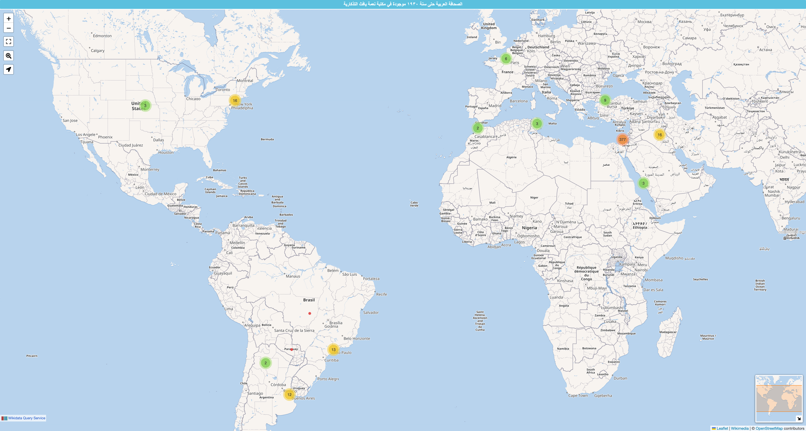][rq:periodicals-lang_ar-filter_collection-aub-disp_map]

### Orient-Institut Beirut (OIB)

- name: `periodicals-lang_ar-filter_collection-oib-disp_map` 
- link: [SPARQL query on Wikidata][rq:periodicals-lang_ar-filter_collection-oib-disp_map] 

[][rq:periodicals-lang_ar-filter_collection-oib-disp_map]


# Editors
## images of editors

Images of editors of Arabic periodicals found on WikiCommons

- name: `editors-disp_imagegrid` 
- link: [SPARQL query on Wikidata][rq:editors-disp_imagegrid] 
- obsolete link: <https://query-chest.toolforge.org/redirect/vWy7oAd56GAWYscO0wyQkQ2M4UQmG4m4AMk8MiAcSEw>

[][rq:editors-disp_imagegrid]

## Age of editors

Table listing the gender (mostly male) and age of editors of Arabic periodicals at the first year of publication

- name: `editors-filter_age`
- link: [SPARQL query on Wikidata][rq:editors-filter_age]
- obsolete link: <https://query-chest.toolforge.org/redirect/TUDcmZHcJcEiC00OWscW2omkcmiSsEa0kIgyeQwwMoe>

## Social network of editors and their relatives.

- name: `editors-social-network-disp_graph` 
- link: [SPARQL query on Wikidata][rq:editors-social-network-disp_graph] 
- obsolete link: <https://query-chest.toolforge.org/redirect/2luB9FLaquKoGoAqcU2mGK6YsWiUiOWUCakOyYEsUOi>

[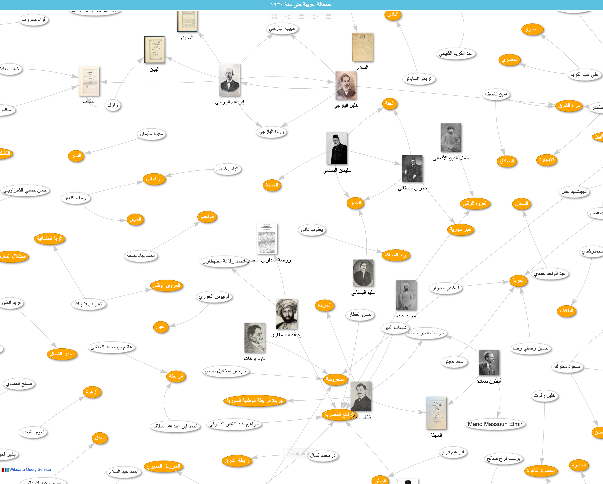][rq:editors-social-network-disp_graph]

# Front pages
## Network of front pages, locations and publication languages

Graph view connecting front pages, publication places and publication languages. This allows to quickly check for any trends or specificities.

- name: `periodicals-lang_ar-image-disp_graph` 
- link: [SPARQL query on Wikidata][rq:periodicals-lang_ar-image-disp_graph] 
- obsolete link: <https://query-chest.toolforge.org/redirect/q8HKXkolw8uYgywMEgGsywuqWSMymGWyCEIEoiqku4Z>

[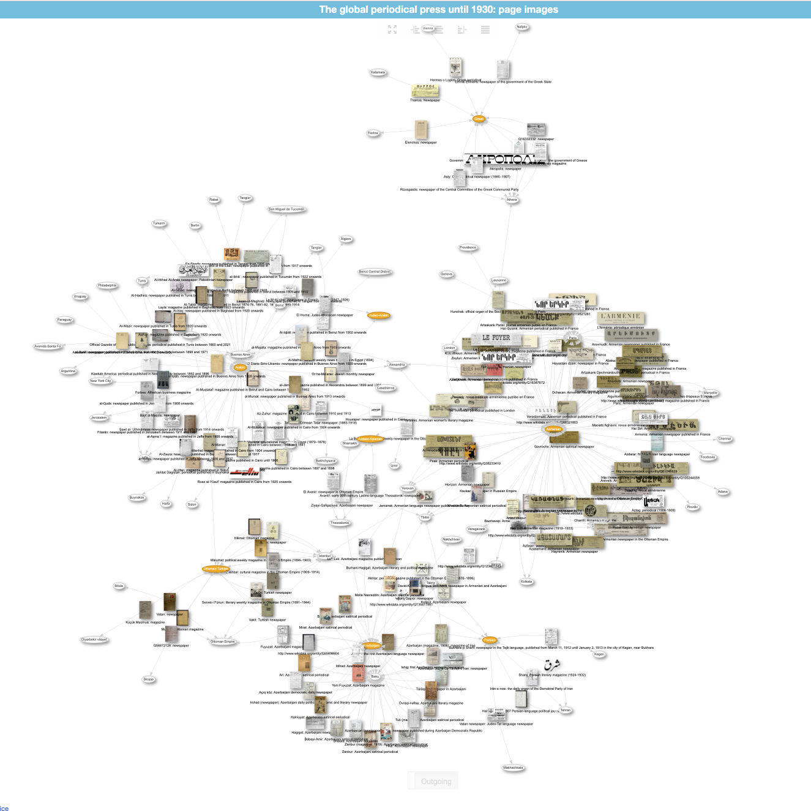][rq:periodicals-lang_ar-image-disp_graph]

# Dimensions
## Page dimensions

Basic table for periodicals with known dimensions. This is mostly based on information imported from library catalogues, which frequently record the height of an item in their collection

- name: `periodicals-lang_ar-dimensions`
- link: [SPARQL query on Wikidata][rq:periodicals-lang_ar-dimensions]
- obsolete link: <https://query-chest.toolforge.org/redirect/1yFIBRrWui6qQQAGAimCOW8gYg08syeWCmIAkG0sSai>

# Geographic regions
## Palestine before the *Nakba*

Instead of a rectangular bounding box, Palestine is defined by an explicitly provided list of publication places.

Note that Wikidata relies on OpenStreetMap for mapping, which not just defaults to Hebrew toponyms within the 1967 borders of Israel but also superimposes the ultra-nationalist Israeli label of "Judea and Samaria" for the illegally occupied Westbank.

### Map of periodicals

- name: `palestine-1948_periodicals_map` 
- link: [SPARQL query on Wikidata][rq:palestine-1948_periodicals_map] 
- obsolete link: <https://query-chest.toolforge.org/redirect/WSB7DBbD7oYkIU2k8KoksQkaauOu8ew8cEOs4CCyCID>

[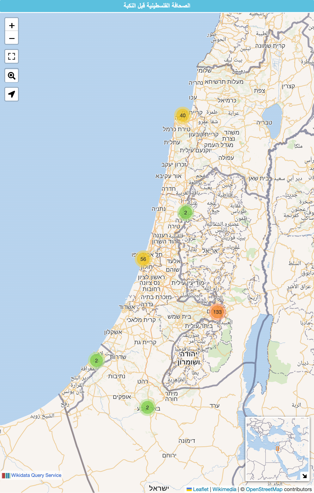][rq:palestine-1948_periodicals_map]

### Map of periodicals with holdings

- name: `palestine-1948_periodicals-holdings_map` 
- link: [SPARQL query on Wikidata][rq:palestine-1948_periodicals-holdings_map] 
- obsolete link: <https://query-chest.toolforge.org/redirect/FastY9YqoKky0AAggWsk4mMeQW284SIOkIGGiEEMQKd>

[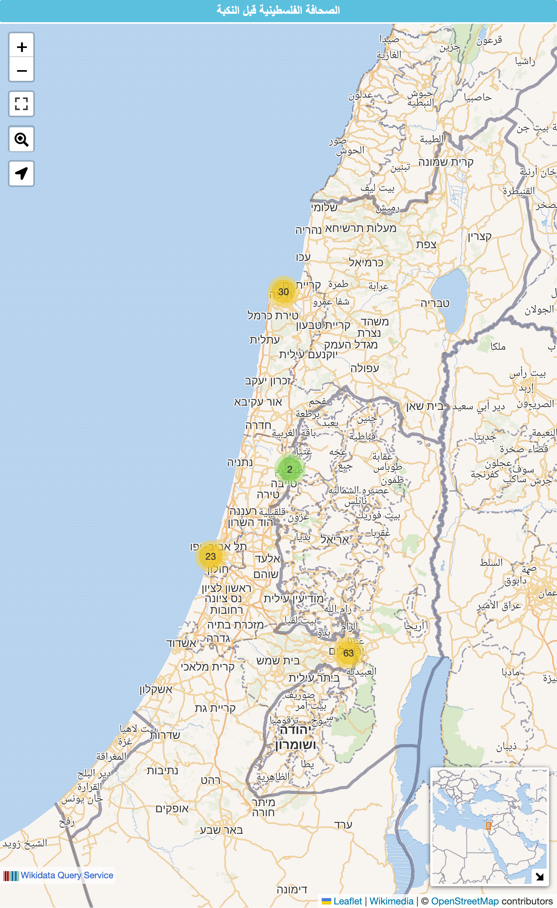][rq:palestine-1948_periodicals-holdings_map]

### Map of holdings

- name: `palestine-1948_periodicals-holdings_map-collection` 
- link: [SPARQL query on Wikidata][rq:palestine-1948_periodicals-holdings_map-collection] 
- obsolete link: <https://query-chest.toolforge.org/redirect/Bsfc1wk38K2WEaQk84qGkyeOkggEea8kGuSMqgGOEU1>

[][rq:palestine-1948_periodicals-holdings_map-collection]

### Map of periodicals with digitised collections

- name: `palestine-1948_periodicals-digitised_map` 
- link: [SPARQL query on Wikidata][rq:palestine-1948_periodicals-digitised_map] 
- obsolete link: <https://query-chest.toolforge.org/redirect/aDYfGc5U3MCeOaWIg0OcKoYK2MMweuiOo8KGA26yOib>

[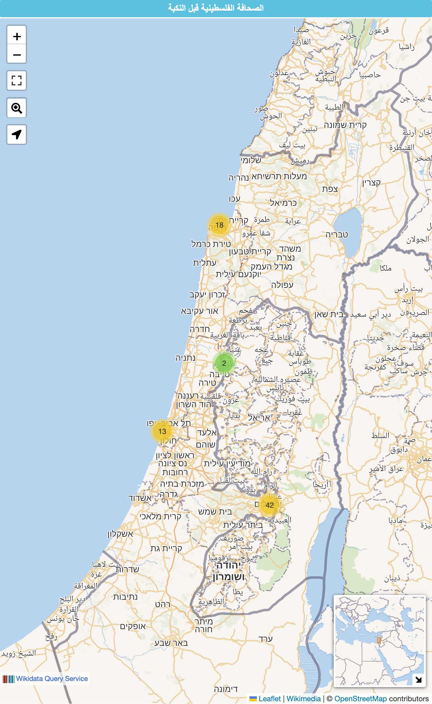][rq:palestine-1948_periodicals-digitised_map]

## Levant

![Map of newspapers published in the Eastern Mediterranean during the summer of 1910, [SPARQL query on Wikidata][rq:map-levant-1910-06].](../assets/img/wikidata-map_periodicals-bilad-al-sham-1910-06-15.png)

![Map of newspapers published in the Eastern Mediterranean during the summer of 1910 with known holdings, [SPARQL query on Wikidata][rq:map-levant-1910-06-holdings].](../assets/img/wikidata-map_periodicals-bilad-al-sham-1910-06-15_holdings.png)

![Map of newspapers published in the Eastern Mediterranean during the summer of 1910 with digitised copies, [SPARQL query on Wikidata][rq:map-levant-1910-06-digitised].](../assets/img/wikidata-map_periodicals-bilad-al-sham-1910-06-15_digitised.png)


# external IDs

These can be used for further queries to external APIs

## Hathitrust IDs

Table that returns QIDs and Hahtitrust IDs, which can be used to query HathiTrust for copies via `https://catalog.hathitrust.org/api/volumes/full/recordnumber/{ID}.json`

- name: `periodicals-lang_ar-filter_ids-hathi`
- link: [SPARQL query on Wikidata][rq:periodicals-lang_ar-filter_ids-hathi]
- obsolete link: <https://query-chest.toolforge.org/redirect/rLaytNA78qsiw2uAuusEMCwESG8yEwqIOWE2AOwwoIZ>

## OCLC IDs

Table that returns QIDs and OCLC IDs (worldcat), which can be used to query HathiTrust for copies via `https://catalog.hathitrust.org/api/volumes/full/oclc/{ID}.json`

- name: `periodicals-lang_ar-filter_ids-oclc`
- link: [SPARQL query on Wikidata][rq:periodicals-lang_ar-filter_ids-oclc]
- obsolete link: <https://query-chest.toolforge.org/redirect/kChWMCQzq2YAy6o0SsAikiouKgIMaqWIos0WwkwuCoa>

